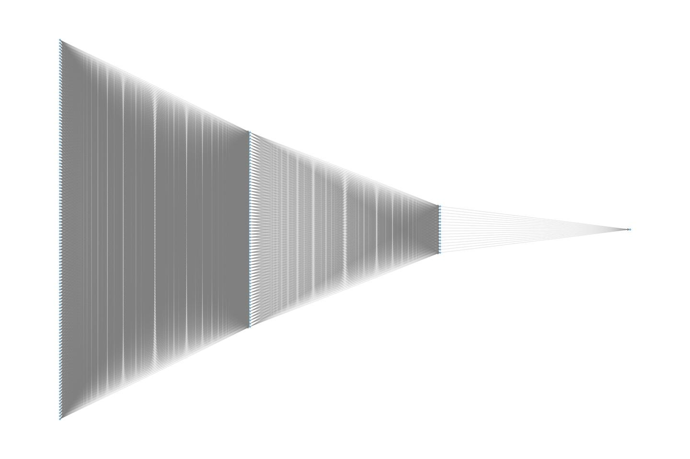
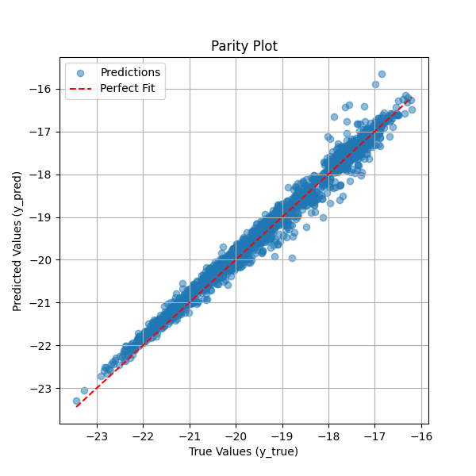
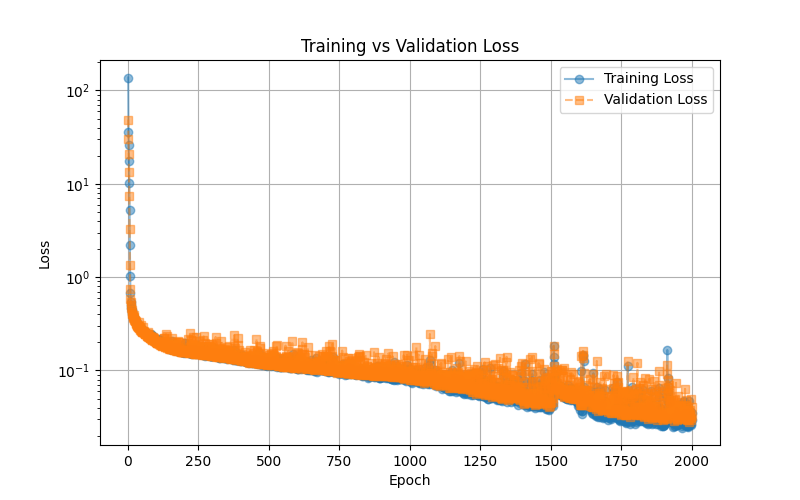
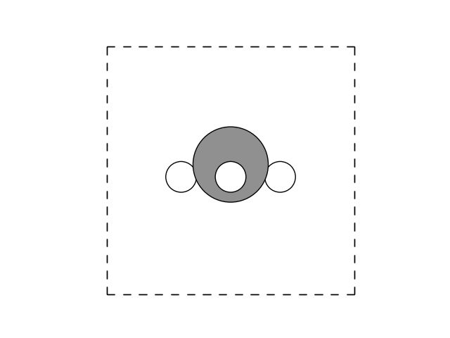
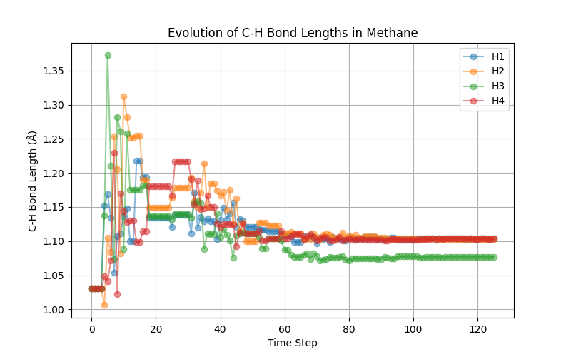
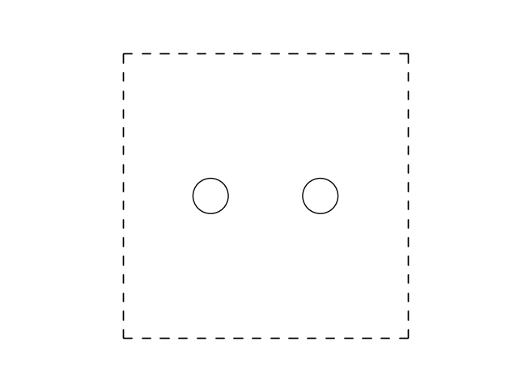

Tutorials
=========

.. important::

    * We assume you have a working environment for running the C++ and Python
      scripts. If not, head over to the Getting Started section.
    * For all commands and instructions shown below, unless explicitly stated, we
      assume that these are executed from the root folder of the repository.
    * Make sure an :code:`output` folder is present in the repository root.
      Graphs will be written in that folder.

Tutorial: Creating a neural network for methane
-----------------------------------------------

Dataset construction and network training
*****************************************

In this tutorial, we are going to draft a Behler-Parrinello Neural Network for
the methane molecule. To build and train the network, we require a dataset. This
dataset is obtained by running AIMD calculations in VASP. The result of this
AIMD simulation is (1) a :code:`XDATCAR` file. For each entry in the
:code:`XDATCAR` we need to associate an energy value, which can be obtained
from the :code:`OUTCAR` file using the following one-liner:

.. code::
    
    grep "y  w" OUTCAR  | awk '{print $7}' > XDATEN

The :code:`XDATCAR` and the freshly created :code:`XDATEN` are both
human-readable files. For efficient (fast!) data handling, we are going to
convert these to a custom binary :code:`pkg` file. This is done using one of the
Python scripts as found in the :code:`pysrc` folder. 

For convenience purposes, example :code:`XDATCAR` and :code:`XDATEN` files for
both a low- and high-temperature AIMD run are already available in the
:code:`/data` folder, which we are going to conver to `.pkg` files using the
commands as seen below:

.. code::

    python3 pysrc/xdatcar2pack.py -x data/XDATCAR_ch4_lt -e data/XDATEN_ch4_lt -o data/ch4_lt.pkg
    python3 pysrc/xdatcar2pack.py -x data/XDATCAR_ch4_ht -e data/XDATEN_ch4_ht -o data/ch4_ht.pkg

The output of either of these commands should look something like this::

    100%|█████████████████████████████████████████████████████████████████████████████████████████| 10000/10000 [00:00<00:00, 25896.52it/s]
    Stored 10000 data files in data/ch4_lt.pkg

These commands will generate two new files:

* :code:`data/ch4_lt.pkg`
* :code:`data/ch4_ht.pkg`

These files contain the geometry and the energies for a number of structures,
in our specific case, 10,000 per file.

Next, we need to generate the Behler-Parrinello symmetry function coefficients
for all these structures. This is a relatively time-consuming step and for that
reason, this generation process is done using a custom C++ program, called
:code:`BPSFP`.

.. code::

    ./build/bpsfp -d data/ch4_lt.pkg -r data/request -o data/ch4_lt_coeff.npz
    ./build/bpsfp -d data/ch4_ht.pkg -r data/request -o data/ch4_ht_coeff.npz

The output of either of these commands should look something like this::

    Progress: [==================================================] 100%
    All done!

These commands will create two more files:

* :code:`data/ch4_lt_coeff.pkg`
* :code:`data/ch4_ht_coeff.pkg`

At this stage, we are done generating the dataset and we can now use this
dataset to train our network. For this fitting step (executed via
:code:`torch/train_ch4.py`), we use the local :program:`perceptronium` Python
package that ships with this repository. The package is primarily focused on
building the neural-network *inputs* (dataset handling, request-file parsing,
and symmetry-function descriptor preparation), while still providing lightweight
utilities for model definition, training, plotting, and model export.

In other words, :program:`perceptronium` is provided as a simple utility package
for this tutorial: it demonstrates one complete fitting workflow and also shows
how to consume the resulting network description for downstream tasks (for
example, optimization scripts that load the trained model).

The default architecture used in this tutorial is defined in
:code:`torch/perceptronium/network.py` via :code:`netconfig=[124, 64, 16, 1]`.
Each atom is processed by a type-specific sub-network with fully connected
layers (124 input features from Behler-Parrinello descriptors, followed by
hidden layers of 64 and 16 neurons, and a scalar output). ReLU activations are
applied between hidden layers, and the final layer remains linear to produce an
atomic embedding energy. During the molecular forward pass, the package applies
the sub-network matching each atom type and sums all per-atom energies to
obtain the total system energy. A visual representation of this per-atom
network is provided below.

To construct and train the BPNN, the Python script as shown below is used.
During training, only the parameters specific to each atom type are optimized.
This means that while five atomic neural networks are used to compute the system
energy, four of them—corresponding to hydrogen (H) share the same network
parameters.

You can copy the Python below and execute it, but a copy of it is placed under
:code:`/torch`.

.. code:: python

    import os
    from perceptronium import MultiMolDataset, MultiMolNet, MolFitter

    ROOT = os.path.dirname(__file__)

    def main():
        paths = [
            os.path.join(ROOT, '..', 'data', 'ch4_ht_coeff.npz'),
        ]
        dataset = MultiMolDataset(paths, os.path.join(ROOT, '..', 'data', 'request'))

        outpath = os.path.join(ROOT, '..', 'output')
        os.makedirs(outpath, exist_ok=True) # ensure folder is created if it does not yet exists

        # set-up fitter class and start training the network
        fitter = MolFitter(num_types=2)
        fitter.fit(dataset, num_epochs=2000)

        # produce fitting plots
        fitter.create_parity_plot(graphfile=os.path.join(outpath, 'ch4_parity.png'))
        fitter.create_loss_history_plot(graphfile=os.path.join(outpath, 'ch4_loss_history.png'))

        # store network
        fitter.save_model(os.path.join(outpath, 'ch4_network.pth'))

    if __name__ == '__main__':
        main()

After running the Python script via

.. code:: bash

    cd torch
    python train_ch4.py

We should see an output similar to this::

    CUDA Available: True
    Number of GPUs: 1
    GPU Name: NVIDIA GeForce RTX 5090
    Using device: cuda
    Epoch     Train Loss     Val Loss       Time (sec)
    ==================================================
        1     129.963365      40.432288      0.82
        2      29.190743      21.992233      0.26
        3      18.683928      13.131295      0.26
        4      10.017776       6.383904      0.20
        5       4.363754       2.401630      0.21
        6       1.652315       0.979695      0.22
        7       0.781263       0.587972      0.21
        8       0.548366       0.469764      0.26
        9       0.465530       0.429274      0.25
        10       0.433574       0.410703      0.23
    
    ...

        1995       0.032276       0.043959      0.22
        1996       0.033596       0.039676      0.22
        1997       0.033915       0.041398      0.20
        1998       0.038798       0.043789      0.22
        1999       0.032037       0.049397      0.27
        2000       0.036683       0.042168      0.25

.. tip::

    If you are running your optimization on a GPU (you should, it is faster!),
    you can check upon its usage via :code:`watch nvidia-smi`, which displays
    something akin to::

        +-----------------------------------------------------------------------------------------+
        | NVIDIA-SMI 580.102.01             Driver Version: 581.57         CUDA Version: 13.0     |
        +-----------------------------------------+------------------------+----------------------+
        | GPU  Name                 Persistence-M | Bus-Id          Disp.A | Volatile Uncorr. ECC |
        | Fan  Temp   Perf          Pwr:Usage/Cap |           Memory-Usage | GPU-Util  Compute M. |
        |                                         |                        |               MIG M. |
        |=========================================+========================+======================|
        |   0  NVIDIA GeForce RTX 5090        On  |   00000000:01:00.0  On |                  N/A |
        | 50%   32C    P0             91W /  575W |    3879MiB /  32607MiB |     10%      Default |
        |                                         |                        |                  N/A |
        +-----------------------------------------+------------------------+----------------------+
    
    The :code:`watch` part ensures this screen is updated every 2 seconds.

After completion of the Python script as shown above, two files are produced
in :code:`/output`:

* :code:`/output/ch4_parity.png`
* :code:`/output/ch4_loss_history.png`

We discuss the results displayed in these files in more detail below.

Training results and interpretation
***********************************

.. note::
    The results presented here should be considered as representative and 
    the actual results you will obtain in your own simulation(s) might differ 
    slightly.

The parity plot below compares the predicted total system energy against the
true system energy. Each blue point represents a single prediction, while the
red dashed line indicates the ideal scenario where predicted values perfectly
match the true values. The close alignment of most points along this diagonal
suggests that the neural network effectively learns to sum the per-atom
embedding energies to produce accurate system energy estimates. Some deviations
at higher energy values indicate minor prediction errors, but overall, the model
demonstrates strong performance in capturing the relationship between atomic
environments and total system energy. This visualization serves as a key
diagnostic tool for assessing the accuracy of the trained neural network.

The training vs. validation loss plot illustrates the model's learning progress
over 2000 epochs. The blue line represents the training loss, while the orange
dashed line represents the validation loss. Initially, both losses start high,
rapidly decreasing as the model learns to minimize error. Over time, the loss
continues to decline smoothly, indicating stable training. The close alignment
between training and validation loss suggests that the model generalizes well
without significant overfitting. Some fluctuations in validation loss are
expected due to variations in the validation set, but overall, the trend
indicates that the neural network successfully optimizes its parameters to
predict total system energy accurately. This plot serves as an essential tool
for diagnosing training stability and model performance.

Network utilization: geometry optimizaton of methane
****************************************************

This script demonstrates how to optimize the geometry of a methane (CH₄)
molecule using a neural network trained to predict atomic energies. The
optimization is performed using the Nelder-Mead algorithm, which iteratively
adjusts atomic positions to minimize the predicted energy of the system. At each
step, the neural network evaluates the energy based on symmetry function
descriptors, and the lowest-energy configuration is tracked. The script provides
a practical example of using machine learning to refine molecular structures
without requiring explicit force calculations.

Additionally, the script saves the optimization trajectory as an animated GIF,
allowing users to visually inspect how the methane molecule's structure evolves
over time. This is particularly useful for analyzing the convergence behavior
and ensuring that the optimization leads to a physically meaningful
configuration.

.. code:: python

    import os
    import time
    import numpy as np
    import ase.io
    from ase import Atoms
    from ase.visualize import view
    from ase.data import atomic_numbers
    import torch
    from scipy.optimize import minimize
    from perceptronium import SymmetryFunctionCalculator

    # Define the root directory
    ROOT = os.path.dirname(__file__)

    def main():
        """
        Main function to optimize methane molecule geometry using a trained neural network.
        """
        # Define atomic symbols and initial positions for methane (CH4)
        symbols = ['C', 'H', 'H', 'H', 'H']
        positions = np.array([
            [5.0, 5.0, 5.0],
            [6.0, 5.0, 5.0],
            [4.0, 5.0, 5.0],
            [5.0, 6.0, 5.0],
            [5.0, 4.0, 5.0]
        ])

        # Create an ASE Atoms object (no periodic boundary conditions)
        methane = Atoms(symbols=symbols, positions=positions)
        methane.center(vacuum = 0.0)
        methane.rotate(45, 'z')

        # Initialize Symmetry Function Calculator
        sfc = SymmetryFunctionCalculator(os.path.join(ROOT, '..', 'data', 'request'),
                                        [atomic_numbers[element] for element in ['C', 'H']])
        
        # Load trained neural network model
        device = torch.device("cuda" if torch.cuda.is_available() else "cpu")
        torch.set_float32_matmul_precision('high')
        mask = torch.tensor(np.ones(len(methane))).to(device)
        model_path = os.path.join(ROOT, '..', 'output', 'ch4_network.pth')
        model = torch.load(model_path, weights_only=False)
        model.to(device).eval()
        model = torch.compile(model)

        # Track iteration history
        iteration_data = []  # Store energy and time per iteration
        position_data = []    # Store molecular positions per iteration
        start_time = time.time()  # Start timer
        bestenergy = float('inf')  # Initialize best energy as a large value
        energy = 0  # Initialize energy value

        def calculate_energy(pos):
            """
            Compute the energy of the system given atomic positions.
            """
            nonlocal energy
            
            # Compute symmetry function coefficients
            coeff = sfc.calculate(pos.reshape((len(methane), -1)), methane.get_atomic_numbers())
            input_tensor = torch.tensor(coeff, dtype=torch.float32).unsqueeze(0).to(device)
            
            # Perform inference with the trained model
            with torch.no_grad():
                energy = model(input_tensor, mask=mask).cpu().detach().numpy()[0, 0]
            return energy

        def callback(current_positions):
            """
            Callback function to track optimization progress.
            """
            nonlocal start_time, bestenergy, energy
            
            # Update best energy if improved
            if energy < bestenergy:
                bestenergy = energy
                position_data.append(current_positions.reshape((len(methane), -1)))
                
                # Compute elapsed time
                elapsed_time = time.time() - start_time
                start_time = time.time()  # Reset timer for next iteration
                
                # Store iteration data
                iteration_data.append((len(iteration_data) + 1, energy, elapsed_time))
                
                # Print iteration progress
                print(f"Iteration {len(iteration_data)}: Energy = {energy:.6f}, Time = {elapsed_time:.4f} sec")

        # Optimize molecular geometry using Nelder-Mead (Simplex Search)
        result = minimize(
            fun=calculate_energy,                       # Energy function
            x0=positions.flatten(),                     # Flattened initial positions
            method='Nelder-Mead',                       # Gradient-free optimization
            callback=callback,                          # Track iterations
            options={'maxiter': 5000, 'fatol': 1e-4}    # Stopping criteria
        )

        # Store optimized atomic configurations, add a unitcell mainly for
        # visualization purposes
        atoms_list = [Atoms(symbols=symbols, positions=pos) for pos in position_data]
        for atoms in atoms_list:
            atoms.set_cell([5.0, 5.0, 5.0])
            atoms.center()

        # store as animated gif
        ase.io.write(os.path.join(ROOT, '..', 'output', 'ch4opt.gif'), atoms_list, format='gif', interval=100, rotation='-90x')

    if __name__ == '__main__':
        main()

Optimization results for methane
********************************

The animated GIF illustrates the optimization process of a methane (CH₄)
molecule, starting from an intentionally unfavorable geometry. The script
automatically refines the atomic positions by minimizing the predicted energy
using a neural network model. However, since the dataset used to train the model
does not contain the optimal methane geometry, the predicted energy is an
extrapolation rather than an exact value. Despite this limitation, the final
structure *seem* to align well with the expected tetrahedral geometry of
methane, yet merely using a visual representation can be misleading, as we are
about to show.

Using the following small snippet, we can also plot the C-H bond lengths
as function of the evolution steps

.. code:: python

    def visualize_bond_lengths(atoms_list):
    """
    Visualizes C-H bond lengths for each Atoms object in the trajectory.
    Returns a dictionary with lists of bond lengths over time.
    """
    bond_data = {f"H{i+1}": [] for i in range(4)}  # Store bond lengths for each H

    for atoms in atoms_list:
        c_index = 0  # Assuming the first atom (index 0) is Carbon
        h_indices = [1, 2, 3, 4]  # Hydrogen indices

        # Compute bond lengths for this step
        bond_lengths = [atoms.get_distance(c_index, h) for h in h_indices]

        # Store in respective lists
        for i, length in enumerate(bond_lengths):
            bond_data[f"H{i+1}"].append(length)

    # Generate time steps (assuming frames are indexed sequentially)
    time_steps = list(range(len(atoms_list)))

    # Plot the evolution of each C-H bond length over time
    plt.figure(figsize=(8, 5))
    for h_label, bond_lengths in bond_data.items():
        plt.plot(time_steps, bond_lengths, label=h_label, marker='o', alpha=0.5)

    plt.xlabel("Time Step")
    plt.ylabel("C-H Bond Length (Å)")
    plt.title("Evolution of C-H Bond Lengths in Methane")
    plt.legend()
    plt.grid(True)
    plt.show()

which yields the following graph

The above plot shows that we do not find the expected tetrahedral symmetry. The
problem lies that our high-temperature dataset does not carry this information.
We leave it as an exercise to the reader to retrain the potential using the
low-temperature data and observe that one indeed recovers the expected
tetrahedral shape.

Network utilization: geometry optimizaton of dihydrogen
*******************************************************

The same neural network used for methane (CH₄) optimization can also be applied
to the H₂ molecule. Although H₂ was not explicitly simulated during training,
the dataset contains relevant atomic environments that provide some information
about this system. By optimizing H₂ using the neural network, we can attempt to
determine an optimal H-H bond distance. However, caution must be exercised when
interpreting the resulting energy values, as the model was not explicitly
trained for this specific molecular system. The predicted energy should be seen
as an extrapolation rather than an exact value, and additional validation may be
necessary to ensure meaningful results.

The following adjustments are made to the script:

.. code:: python

    import os
    import time
    import numpy as np
    import ase.io
    from ase import Atoms
    from ase.visualize import view
    from ase.data import atomic_numbers
    import torch
    from scipy.optimize import minimize
    from perceptronium import SymmetryFunctionCalculator

    # Define the root directory
    ROOT = os.path.dirname(__file__)

    def main():
        """
        Main function to optimize h2 molecule geometry using a trained neural network.
        """
        # Define atomic symbols and initial positions for H2
        symbols = ['H', 'H']
        positions = np.array([
            [-1.0, 0.0, 0.0],
            [ 1.0, 0.0, 0.0],
        ])

        # Create an ASE Atoms object (no periodic boundary conditions)
        h2 = Atoms(symbols=symbols, positions=positions)
        h2.center(vacuum = 0.0)

        # Initialize Symmetry Function Calculator
        sfc = SymmetryFunctionCalculator(os.path.join(ROOT, '..', 'data', 'request'),
                                        [atomic_numbers[element] for element in ['C', 'H']])
        
        # Load trained neural network model
        device = torch.device("cuda" if torch.cuda.is_available() else "cpu")
        torch.set_float32_matmul_precision('high')
        mask = torch.tensor(np.ones(len(h2))).to(device)
        model_path = os.path.join(ROOT, '..', 'output', 'ch4_network.pth')
        model = torch.load(model_path, weights_only=False)
        model.to(device).eval()
        model = torch.compile(model)

        # Track iteration history
        iteration_data = []  # Store energy and time per iteration
        position_data = []    # Store molecular positions per iteration
        start_time = time.time()  # Start timer
        bestenergy = float('inf')  # Initialize best energy as a large value
        energy = 0  # Initialize energy value

        def calculate_energy(pos):
            """
            Compute the energy of the system given atomic positions.
            """
            nonlocal energy
            
            # Compute symmetry function coefficients
            coeff = sfc.calculate(pos.reshape((len(h2), -1)), h2.get_atomic_numbers())
            input_tensor = torch.tensor(coeff, dtype=torch.float32).unsqueeze(0).to(device)
            
            # Perform inference with the trained model
            with torch.no_grad():
                energy = model(input_tensor, mask=mask).cpu().detach().numpy()[0, 0]
            return energy

        def callback(current_positions):
            """
            Callback function to track optimization progress.
            """
            nonlocal start_time, bestenergy, energy
            
            # Update best energy if improved
            if energy < bestenergy:
                bestenergy = energy
                position_data.append(current_positions.reshape((len(h2), -1)))
                
                # Compute elapsed time
                elapsed_time = time.time() - start_time
                start_time = time.time()  # Reset timer for next iteration
                
                # Store iteration data
                iteration_data.append((len(iteration_data) + 1, energy, elapsed_time))
                
                # Print iteration progress
                print(f"Iteration {len(iteration_data)}: Energy = {energy:.6f}, Time = {elapsed_time:.4f} sec")

        # Optimize molecular geometry using Nelder-Mead (Simplex Search)
        result = minimize(
            fun=calculate_energy,                       # Energy function
            x0=positions.flatten(),                     # Flattened initial positions
            method='Nelder-Mead',                       # Gradient-free optimization
            callback=callback,                          # Track iterations
            options={'maxiter': 5000, 'fatol': 1e-4}    # Stopping criteria
        )

        # Store optimized atomic configurations, add a unitcell mainly for
        # visualization purposes
        atoms_list = [Atoms(symbols=symbols, positions=pos) for pos in position_data]
        for atoms in atoms_list:
            atoms.set_cell([5.0, 5.0, 5.0])

            atoms.center()

        # store as animated gif
        ase.io.write(os.path.join(ROOT, '..', 'output', 'h2opt.gif'), atoms_list, format='gif', interval=100)

    if __name__ == '__main__':
        main()

Optimization results for dihydrogen
***********************************

The animated GIF illustrates the optimization process of an H₂ molecule,
starting from an intentionally unfavorable bond distance. The script
automatically adjusts the atomic positions by minimizing the predicted energy
using a neural network model. However, since the dataset used to train the model
does not explicitly include the optimal H₂ bond length, the predicted energy
represents an extrapolation rather than an exact value. Despite this limitation,
the final structure converges to a physically reasonable H–H distance,
demonstrating the model's ability to capture meaningful trends in atomic
interactions.

